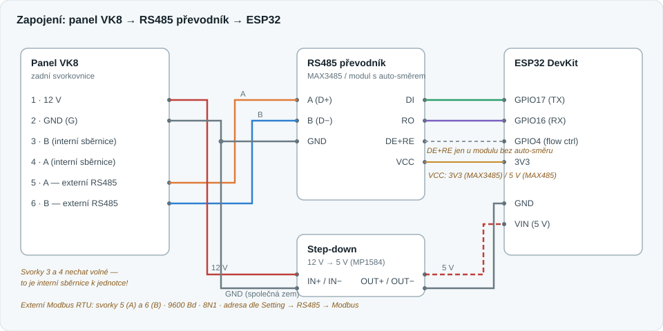
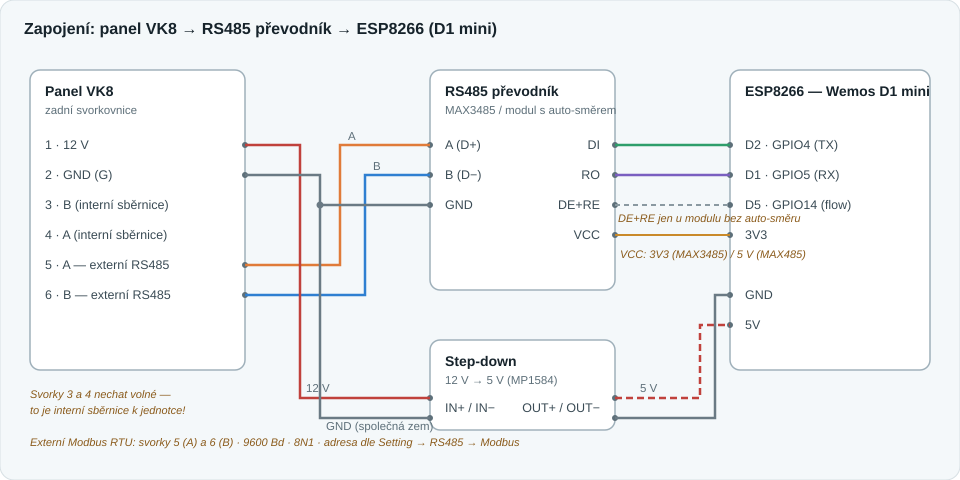

# Rekuperace E-VIPO MVHR — český návod + integrace do Home Assistanta

Podklady a integrace pro rekuperační jednotku **E-VIPO MVHR řady TP**
(TP350–TP600, ERV/HRV) s dotykovým panelem **VK8**.

| Složka | Obsah |
|---|---|
| `web/` | Kompletní český překlad manuálů (jednotka + VK8 + Modbus protokol) s fotkami originálu — nasazeno na <https://paja.hkfree.org/rekuperace/> |
| `esphome/` | ESPHome konfigurace ESP32 můstku Modbus RTU → Home Assistant |
| `homeassistant/` | HA balíček (skripty, automatizace) a Lovelace karta |

## Jak to funguje

Panel VK8 má na zadní svorkovnici vyvedený **externí RS485 (Modbus RTU slave)**.
ESP32 s RS485 převodníkem se na něj pověsí jako master, čte čidla a posílá
povely; do Home Assistanta jde vše nativně přes ESPHome API (WiFi).





> **Pozor:** svorky **3 a 4** panelu jsou interní sběrnice k jednotce — na ty
> nic nepřipojovat. Externí Modbus patří výhradně na svorky **5 (A)** a **6 (B)**.

## Hardware

- **ESP32 DevKit** (`esphome/rekuperace.yaml`) — hardwarový UART, doporučená volba
- **ESP8266 / Wemos D1 mini** (`esphome/rekuperace-8266.yaml`) — funguje stejně
  dobře; ESPHome na pinech D1/D2 použije softwarový UART, který na 9600 Bd
  běží spolehlivě. Vyhni se boot pinům D3 (GPIO0), D4 (GPIO2), D8 (GPIO15)
- **RS485 převodník — doporučené varianty:**
  - **Modul s automatickým řízením směru** (čip **MAX13487E** nebo deska
    „XY-017 / HW-0519 auto flow control") — *nejjednodušší volba*, nepotřebuje
    pin DE/RE, v konfigu se nic neodkomentovává
  - **MAX3485 modul** — 3,3V logika, ideální k ESP32; pokud nemá automatiku
    směru, spoj piny DE+RE dohromady a přiveď na GPIO4 (`flow_control_pin`)
  - Klasický modrý **MAX485 modul** funguje také (většina kusů snese 3,3V
    logiku, jinak napájej 5 V a signály jsou tolerantní); DE+RE → GPIO4
- **Step-down 12 V → 5 V** (např. mini MP1584) — napájení ESP přímo
  z panelu/svorkovnice, odpadá zvláštní zdroj

### Zapojení

| Panel VK8 (zadní svorkovnice) | RS485 modul | ESP32 |
|---|---|---|
| 5 · **A** | **A** (D+) | — |
| 6 · **B** | **B** (D−) | — |
| 2 · GND (nebo GND na T3-D1) | GND | GND |
| 1 · 12 V | — | přes step-down na 5V/VIN |
| — | DI | GPIO17 (TX) · na D1 mini D2/GPIO4 |
| — | RO | GPIO16 (RX) · na D1 mini D1/GPIO5 |
| — | DE+RE (jen bez automatiky) | GPIO4 · na D1 mini D5/GPIO14 |
| — | VCC | 3V3 (MAX3485) / 5V (MAX485) |

Poznámky:
- **Společná zem** ESP ↔ panel je nutná (RS485 je rozdílový, ale referenci
  potřebuje). Při napájení ze svorky 12 V ji máš automaticky.
- Krátké vedení (do pár metrů) nepotřebuje 120Ω terminátor; u delších tras
  ho dej mezi A a B na straně ESP.
- A/B bývá u čínských modulů někdy prohozené — když nic nechodí, prohoď vodiče.

## ESPHome

```bash
cd esphome
# doplň secrets.yaml (wifi_ssid, wifi_password)
esphome run rekuperace.yaml
```

Na panelu zapni Modbus: **Setting → RS485 → Modbus** → přepínač
*Modbus Auxiliary Engine* + adresa (výchozí 001, musí sedět se
`modbus_address` v YAML).

Konfigurace vystavuje:

- **Čtení:** teploty (odtah/výfuk/venkovní), vlhkost, PM2.5, CO₂, VOC,
  odmrazování, hodiny filtrů G/F/H; připravené (zakomentované) bloky pro
  externí čidla Onsite0–8. Chybové hodnoty (0x7FFF/0xFFFF/0x00FF) se
  filtrují na `NaN`.
- **Ovládání:** zapnutí, režim (Auto/Ruční/Spánek), stupně obou ventilátorů,
  boost, bypass (klapka + automatika), externí klapka, dohřev/předehřev,
  Fan Separation, Free Cooling, resety počítadel filtrů (zápis 0xAA).

> **Pozor:** zápisy panel provede jen v **ručním režimu** (registr 01 = 1).
> HA skripty v `homeassistant/` proto před povelem režim samy přepínají.

## Home Assistant

Aktuálně nasazená karta je v `homeassistant/rekuperace-live-card.yaml`.
Vlož ji jako ruční kartu do samostatného pohledu **Rekuperace** s rozložením
**Panel (samostatná karta)**. Obsahuje živé hodnoty, ovládání, grafy a vložené
SVG schéma; zdroj obrázku je také v `docs/rekuperace-live.svg`.
Animace jsou ilustrativní a nejsou vázané na skutečný běh ventilátorů.

Nasazené zapojení D1 mini s XY-017 používá **TX D2 / GPIO4** a
**RX D5 / GPIO14**, společnou zem a Modbus 9600 8N1, adresu 1.
Oba ventilátory mají rozsah **0–5**; pro samostatné řízení použij ruční
režim a Fan Separation. OTA zůstává povolené. Aktuální konfigurace
obsahuje diagnostické UART logování, keepalive a místní web na portu 80;
ESPHome API nemá nastavené šifrování.

1. `homeassistant/rekuperace_package.yaml` → `config/packages/`
   (skripty boost/stupeň/zpět-do-auto, automatizace sprcha → boost,
   hlídání limitu filtrů)
2. `homeassistant/dashboard-card.yaml` → Lovelace ruční karta

## Dokumentace

- Český překlad manuálů: `web/index.html` (nasazeno na
  [paja.hkfree.org/rekuperace](https://paja.hkfree.org/rekuperace/))
- Modbus mapa registrů: `web/vk8-modbus-protokol.pdf`
  (VK8 External Modbus Protocol V1.0.14 — 9600 Bd 8N1, funkce 0x03/0x06/0x10,
  registry 0–49)
